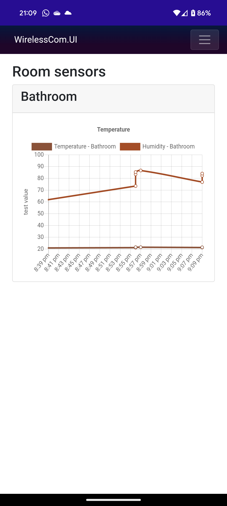
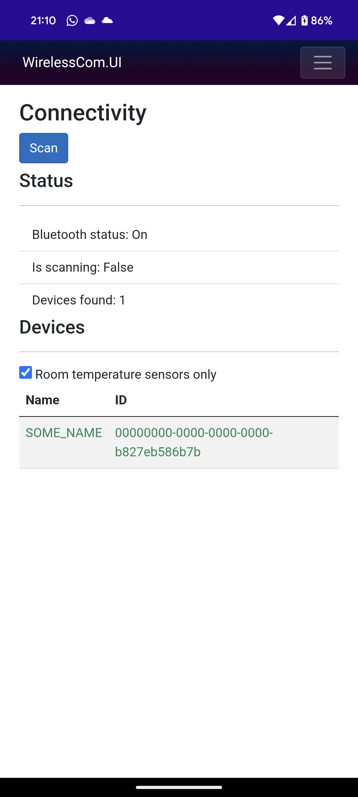

<!-- PROJECT ICON -->
 

  

  <h3 align="center">Wireless Communication</h3>

  

    Project repo for the Saxion Internet of Things wireless-communication class for 2023-2024 Q1 & Q2.
     
    <a href="https://github.com/NancyTang50/wireless-communication/tree/main/docs"><strong>Explore the docs »</strong></a>
     
  

<!-- TABLE OF CONTENTS -->
## Table of Contents <!-- omit in toc -->
- [About The Project](#about-the-project)
  - [Built With](#built-with)
- [Getting Started](#getting-started)
- [App preview](#app-preview)

<!-- ABOUT THE PROJECT -->
## About The Project
The goal of this project is to create a wireless communication system between a central and multiple peripherals.
We have decided to create an app to display environmental data from multiple sensors, for example temperature and humidity.

We have created three different programs in during this project. Two of which are BLE peripherals and one is a BLE central.
The BLE peripherals are a Raspberry Pi and an Nordic nrf52840. The central is a mobile phone running either Android. IOS should also work but has not been tested yet since we do not have an IOS device.

<!-- BUILT WITH -->
### Built With
[DOTNET 8](https://dotnet.microsoft.com/download/dotnet/8.0)
[MAUI](https://learn.microsoft.com/en-us/dotnet/maui/what-is-maui?view=net-maui-8.0)
[dotnet-bluetooth-le](https://github.com/dotnet-bluetooth-le/dotnet-bluetooth-le)
[Rust](https://www.rust-lang.org/)
[PlatformIO](https://platformio.org/)

<!-- GETTING STARTED -->
## Getting Started
Each of the three programs have their own README.md file with instructions on how to run them.

<!-- APP PREVIEW SCREENSHOTS -->
## App preview
All room sensor from the previous hour is displayed on the home screen.
The user can click on a sensor name to change the name of the sensor.
Data will still be shown even when the device is not currently connected to the sensor.

All nearby sensors are displayed on the connectivity screen.

The list of devices can be filtered be filtered to only show devices that work with the app.

A modal with some generic device info will be shown after clicking on a specific device.

After clicking on the connect button the app will also show all the available services for the device.
All the characteristic values for the temperature and humidity are handled in the background via a notify event from the peripherals.

