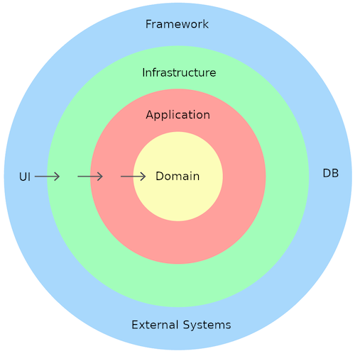

# Wireless Communication Report <!-- omit in toc -->

- [Introduction](#introduction)
- [The goal of the system](#the-goal-of-the-system)
- [The roles of the different devices](#the-roles-of-the-different-devices)
  - [Server - Nordic-nRF52 \& Raspberry Pi](#server---nordic-nrf52--raspberry-pi)
  - [Client - Android phone](#client---android-phone)
- [Services \& characteristic](#services--characteristic)
  - [Services details](#services-details)
  - [Environmental sensing service](#environmental-sensing-service)
    - [Encoding of the bytes](#encoding-of-the-bytes)
    - [Temperature Characteristic](#temperature-characteristic)
    - [Humidity Characteristic](#humidity-characteristic)
  - [Current time service](#current-time-service)
    - [Encoding of the bytes](#encoding-of-the-bytes-1)
    - [Current time characteristic](#current-time-characteristic)
- [How to use the system](#how-to-use-the-system)
  - [Prerequisites](#prerequisites)
- [Coding explanation](#coding-explanation)
  - [Mobile APP](#mobile-app)
    - [BLE](#ble)
    - [Persistence](#persistence)
  - [Raspberry Pi](#raspberry-pi)
  - [Nordic-nrF-52840](#nordic-nrf-52840)
- [Testing](#testing)
- [Problems we encountered](#problems-we-encountered)
  - [Nordic problems](#nordic-problems)
    - [Nordic Mbed OS](#nordic-mbed-os)
    - [Nordic DHT library timing issue](#nordic-dht-library-timing-issue)
  - [Finding examples of the Raspberry Pi](#finding-examples-of-the-raspberry-pi)
  - [BLE library app](#ble-library-app)

## Introduction

For this project we developed a cross-platform app to show the temperature and the humidity of the locations where the sensors are. This is interesting for detecting variations in temperature and humidity across different places. To achieve this, we are using the DHT22 sensor to measure the temperature and humidity for the Nordic-nRF52 board and Raspberry Pi and we will show the  current time of these two peripherals.

## The goal of the system

The goal of our system is to create and implement two different BLE peripherals that will read the temperature and humidity of a location with a DHT22 sensor. The peripherals will send the data to a central device, which in our case will be an Android phone. The Android phone will show the current and past readings in a graph.

## The roles of the different devices

In this chapter we will explain the roles of the different devices in the chapters.

### Server - Nordic-nRF52 & Raspberry Pi

Raspberry Pi and the Nordic-nrF-52840 are both using the DHT22 sensors, because these two devices will act as peripherals. To read the temperature and humidity values from the DHT22 sensors, two separate applications will be developed. One application will be developed in Rust for the Raspberry Pi. And another application will be developed in C++ with PlatformIO.

### Client - Android phone

The Android phone will act as a BLE central. The .NET MAUI cross-platform app will be developed to manage the receiving data of the connected BLE devices. The received data will be stored in a local SQL lite database and shown in a couple charts. The app supports multiple peripherals at once.

## Services & characteristic

The Nordic-nrF52 and Raspberry Pi act as peripherals. These peripherals supports two services. These two services are environmental sensing service, and the current time service.

### Services details

We are using the following BLE service definitions in our system:

| Service                        | Service UUID | Characteristic | Characteristic UUID | Description                                   | Supported actions |
|--------------------------------|--------------|----------------|---------------------|-----------------------------------------------|-------------------|
| Environmental sensing services | 0x181A       | Humidity       | 0x2A6F              | Get or get updated on the current humidity    | Read, Notifying   |
| Environmental sensing service  | 0x181A       | Temperature    | 0x2A6E              | Get or get updated on the current temperature | Read, Notifying   |
| Current time service           | 0x1805       | Current time   | 0x2A2B              | Get or set the current time for a peripheral  | Read, Write       |

### Environmental sensing service

The environmental sensing service supports multiple optional sensors. Our implementation only supports the temperature and humidity.

#### Encoding of the bytes

The temperature and the humidity are both floating point values, because of this they both have the same encoding. First the value needs to be multiplied by 100, then this value needs to be converted into a signed 16 bit number. Then this number can be send in little endian format. The pseudo code of this can be found below:

```python
some_float_value = 22.5
signed_16_bits = (signed 16 bits)(22.5 * 100)
low_byte = signed_16_bits & 0xFF
high_byte = (signed_16_bits >> 8) & 0xFF
[low_bytes, high_byte]
```

#### Temperature Characteristic

In our system, the temperature characteristic supports reading and notifying the current Celsius temperature of the DHT22 sensor.

#### Humidity Characteristic

In our system, the humidity characteristic supports reading and notifying the current humidity percentage of the DHT22 sensor.

### Current time service

The current time service displays the current time of the peripheral device. The current time service has a current time characteristic.

#### Encoding of the bytes

The current time is encoding using in the following way:

| byte            |       1        |        2        |   3   |  4  |   5   |    6    |    7    |        8        |       9       |        10         |
|-----------------|:--------------:|:---------------:|:-----:|:---:|:-----:|:-------:|:-------:|:---------------:|:-------------:|:-----------------:|
| **Description** | year low bytes | year high bytes | month | day | hours | minutes | seconds | day of the week | fractions 256 | adjustment reason |

All values are 1 bytes, except for the year. The year needs to be little endian encoded.

We wrote some example code to encode the current datetime and decode the current date time.

This test code is used for debugging the encoding and decode the raw bytes to a readable datetime.
Execute this Javascript below in the console of your browser. For example Google Chrome. After you receive the encoding, send the encoding with the NRF connect mobile app through the Bluetooth as BYTEARRAY.

```js
function EncodeCurrentDate() {
    const date = new Date();
    const yearBytes = new Uint16Array([date.getFullYear()]);

    const bleEncodedBytes = [];
    bleEncodedBytes.push(yearBytes[0] & 0xFF);
    bleEncodedBytes.push((yearBytes[0] >> 8) & 0xFF);
    bleEncodedBytes.push(date.getMonth() + 1);
    bleEncodedBytes.push(date.getDate());
    bleEncodedBytes.push(date.getHours());
    bleEncodedBytes.push(date.getMinutes());
    bleEncodedBytes.push(date.getSeconds());

    const hexNumber = Array.from(bleEncodedBytes, byte => byte.toString(16).padStart(2, '0')).join('');
    console.log(`Value is ${hexNumber}`);
    return hexNumber;
}
```

```js
function DecodeBLEBytes(inputBytes) {
    const bleEncodedBytes = Array.from(inputBytes.match(/.{1,2}/g).map(x => parseInt(x, 16)));
    const year = (bleEncodedBytes[1] << 8 ) | bleEncodedBytes[0];
    const month = bleEncodedBytes[2];
    const day = bleEncodedBytes[3];
    const hours = bleEncodedBytes[4];
    const minutes = bleEncodedBytes[5];
    const seconds = bleEncodedBytes[6];
    const day_of_week = bleEncodedBytes[7];
    const fractions = bleEncodedBytes[8];
    const adjust_reason = bleEncodedBytes[9];

    console.log('Converted time is',
    `year: ${year} 
    month: ${month} 
    day: ${day} 
    hours: ${hours} 
    minutes: ${minutes} 
    seconds: ${seconds}
    day of week: ${day_of_week} 
    fractions: ${fractions} 
    adjust reason: ${adjust_reason}`);
}
```

#### Current time characteristic

In our system, the current time characteristic supports reading and writing the current time. If you read the time before writing the current time, the response may be inaccurate depending on the platform.

## How to use the system

First follow the [Prerequisites](#prerequisites), then the app on your phone can be started.
To connect to peripherals, go to the connectivity page


Here you can press the scan button to see all the bluetooth devices near you. If you want to see only the intended peripherals, you need to enable the filtering by clicking on the checkbox Room temperature sensors only. This is shown below:


To connect to the peripheral, just click on the name. Then a dialog will open allowing the user to see more information about the device and a connect button below. This is shown in below:


After connecting to the device the disconnect button will become visible.

.

The new data will be shown on the home page of the app, when the peripheral sends data to the mobile phone. There you can see a graph per connected device. The name of the devices can be change by tapping on the name, then the user can enter a new name for the device.


### Prerequisites

The wiring of the DHT22 sensor depends on the platform. The wiring of the Raspberry Pi can be found [here](https://github.com/NancyTang50/wireless-communication/blob/master/src/pi/README.md) and the Nordic-nrF52840 can be found [here](https://github.com/NancyTang50/wireless-communication/blob/master/src/platformio/README.MD).

After setting up the peripherals you need to install the app using the installation [guide](https://github.com/NancyTang50/wireless-communication/blob/master/src/app/README.md).

## Coding explanation
In this chapter we will explain the program structures in the subchapters below.

### Mobile APP

We are following the Clean Architecture pattern together with MVVM. Meaning, the app is layered in four layers: Domain, Application, Infrastructure, and presentation (UI). The keen eye will notice that we have an extra project for the persistance. This project was required because EF-Core fails to run migrations on MAUI class projects.



The main rule of Clean Architecture is that code dependencies can only come from the outer levels inward. Code on the inner layers can have no knowledge of functions on the outer layers.

* **Domain:** Contains all the domain models, entities, interfaces, exceptions, and logic specific to the domain layer.
* **Application:** Contains all application logic and interfaces specific to the application layer. The interfaces that require anything outside of the application layer are defined here. Like the interfaces for the DB access, file access, and any other interfaces that requires anything external.
* **Infrastructure:** Contains classes for accessing external resources such as file systems, web services, smtp, and so on. These classes should be based on interfaces defined within the application layer.
* **UI:** This layer only depends on the infrastructure and application layers. It contains the UI logic and the UI components. It should only depend on the infrastructure layer.

#### BLE

We have created an `BleService` communicate with BLE devices. This service is a generic implementation to talk with all different kinds of BLE device. After this we have created an `BleRoomSensorService` that uses the `BleService` to communicate with our custom room sensors.

#### Persistence

We are using the `UnitOfWork` pattern for  all the persistence classes. This means that each table has its own repository. The repository interfaces are defined in a generic way to allow for changes in the future. The `UnitOfWork` contains all the repositories and is responsible for saving the changes to the database. Each repository implementation implements a generic repository implementation. This contains all basic queries that can be used in most scenarios. 

### Raspberry Pi

The Raspberry Pi's program is written in the language Rust. A Rust binary project always contains a main.rs file, where a main function can be found. The main function is the starting point of a Rust project. The main function initializes the peripheral with the services.

To create a BLE peripheral program for the Raspberry Pi the package [Bluster](https://docs.rs/bluster/0.2.0/bluster/index.html) is used. The Bluster package uses the official Bluetooth program of Linux called [BlueZ](https://www.bluez.org/)

The services are defined in the gatt folder. The gatt folder contains a characteristic folder that contains generic characteristic code. The other folders are the services that are supported by the Raspberry Pi. The services are defined in the mod.rs file, there are create the service methods. These methods create the characteristics for the service.

The characteristics all contain a create characteristic function. The create characteristic function creates a characteristic handler that is used to handle incoming messages. The handling of these message will be executed in a new thread. After setting up the handling of the messages the bluster characteristic returned. To allow the characteristic handler to handle the messages, the characteristic needs to implement the GattEventHandler trait. This will define handle request method, where all incoming message the the characteristic need to be handled. To allow for notify subscriptions the characteristic also needs implement the SensorDataHandler trait. This allows the characteristic to receive updates of the DHT22 sensor.

### Nordic-nrF-52840

The Nordic-nrF-52840's program is written in the language C with PlatformIO using the Arduino library. This resulted that the project always have a main.cpp containing two standard functions called setup() and loop(). The setup function is the starting point of a PlatformIO project. The setup function initialize the services and add the characteristics to the Peripheral. 

To create a BLE peripheral program for the Nordic-nrF52840 the package [BLEPeripheral](https://registry.platformio.org/libraries/sandeepmistry/BLEPeripheral) is used. 


The characteristics folder contains all the characteristics that are being used and a generic characteristic interface where all the characteristics will be extending from. The services are initialized and defined in the main.cpp. To create a new characteristic. You need to create two files in the characteristic folder with the extension .cpp and .h file. After you create these two files. You need to include the characteristic.h and BLEPeripheral.h in your created .h file. Then you need to create a class in the created .h file and extend the characteristic interface.

## Testing

The main testing method of the peripherals was using the [nRF Connect for Mobile](https://play.google.com/store/apps/details?id=no.nordicsemi.android.mcp&hl=nl&gl=US) app. Using this app we could test if the UUID's were correct, because the nRF Connect for Mobile app parses them to show the correct name. With the nRF Connect for Mobile app we could also test the response, the response also gets parsed by the app. Using this we could see if our response were the correct responses for the characteristics we provide. 

Next to the testing with the nRF Connect for Mobile app are unit tests for the Maui App and the Raspberry Pi. The Maui App has tests for decoding the floating point values and tests to decode and encode the current time to BLE bytes. The Raspberry Pi has unit tests to test the encoding of the floating point values, and decoding and encoding the current time to BLE bytes.
 
## Problems we encountered

This chapter explains the problems and difficulties we encounter during this project.


### Nordic problems 

#### Nordic Mbed OS

At the beginning of this project, it was required to use Mbed OS to develop the Bluetooth program for the Nordic-nRF52840. However, when I attempted to flash the program, it refused to do so because it got stuck during the 'building' process. In an attempt to resolve this issue, I tried flashing the Nordic-nRF52840 using the default template for the Blinky program in Mbed OS but encountered the same problem as before.

After searching for a solution online without success, I asked the teacher if he might know how to solve it. He tried updating the firmware of his Nordic-nRF52840, and it worked with his MacBook. Consequently, he updated the firmware of my Nordic-nRF52840. However, when I attempted to flash the Blinky program again on Windows, it still did not work. Even the online Mbed OS compiler could not detect the Nordic-nRF52840, because it only detect the JLink of the Nordic-nRF52840.

Then I asked a classmate what kind of program he uses for developing on the Nordic-nRF52840, and he use PlatformIO to create the BLE program for his nRF52 board. So I tried to use PlatformIO as well and tried to run a BLE example program of PlatformIO. The BLE example program flashed finally on the Nordic-nRF52840 after countering issues with my windows map structure.

#### Nordic DHT library timing issue

To read the temperature and humidity values from the DHT22 sensor, I use an Arduino library called the DHT sensor library created by Adafruit. However, every time I received new humidity and temperature values, there was a chance that the Nordic-nRF52840 would crash and restart the program. I attempted to use another DHT22 library, but it resulted the same problem that has been described above. But adjusting the duration for reading new values to 60 seconds made the Nordic-nRF52840 more stable; however, it still occasionally crashed and restarted the program.


### Finding examples of the Raspberry Pi

Initially we had a lot of difficulty finding an example of BLE peripheral implementation in Rust. This was due to the constraint that we did not want to use embedded Rust, because we never used embedded Rust. After some research we found the package [Bluster](https://docs.rs/bluster/0.2.0/bluster/index.html), but the documentation of this package is empty. After searching in the GIT repository we found the [it_advertises_gatt](https://github.com/dfrankland/bluster/blob/e928dd6491d4cc3c42164b6594a4d584b240c8e1/tests/peripheral.rs#L26C19-L26C19) test, where a basic application is created. Later we found an issue that asked the maintainer for documentation/examples, where the maintainer linked to a complete application called [bleboard](https://github.com/dfrankland/bleboard/tree/master).

### BLE library app

We ran into many difficulties during the development of the app. The most problematic issues all resolved around the BLE library that we were using. For example, the library has many different concurrency issues that will result in deadlocks. We have fixed most of the deadlocks by wrapping the above mentioned `BleService` in a locked implementation of it called the `LockedBleService`. This wraps all calls in [SemaphoreSlim](https://learn.microsoft.com/en-us/dotnet/api/system.threading.semaphoreslim?view=net-8.0)s. Each device has it's own semaphore, so that the devices can still be accessed concurrently. However, this prevents multiple calls to the same device at the same time. This has solved the most deadlocks in our app.
