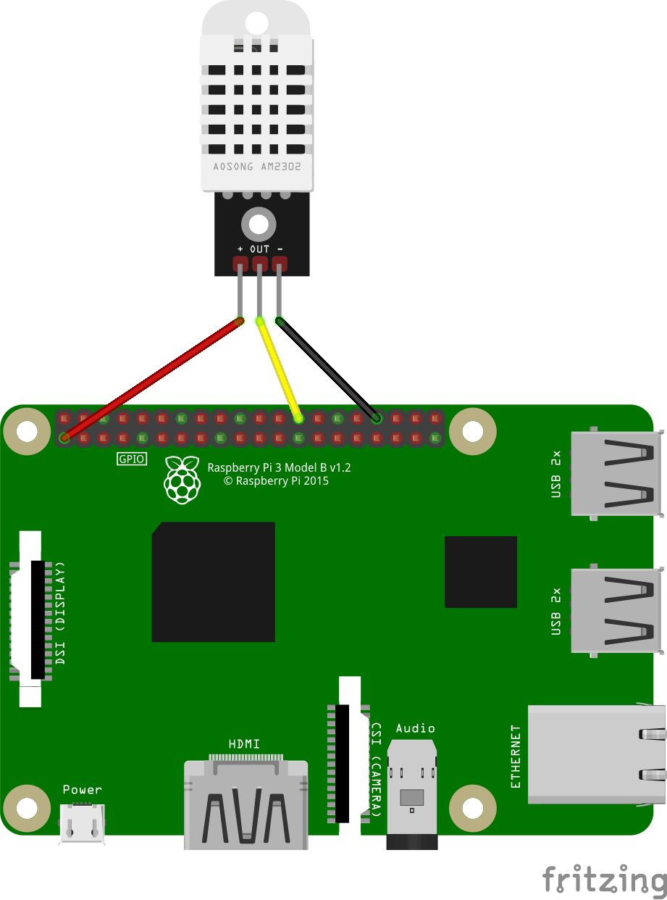

# PI Peripheral

To develop the code for the PI, please follow the install guide for [Docker](https://www.docker.com/get-started/). Then you need to install [Visual Studio Code](https://code.visualstudio.com/download) and install the [Dev Container](https://marketplace.visualstudio.com/items?itemName=ms-vscode-remote.remote-containers) extension. The usage of the dev container will ensure that the Rust language is correctly installed with the cross compilation for the architecture of the Raspberry PI.

To compile the code in debug mode run the following command:
```bash
cargo b
```
To compile the code in release mode run the following command:
```bash
cargo b -r
```

Then the binary can be found in the folder `.\target\aarch64-unknown-linux-gnu\` and then the debug or release folder.
There you can find the binary named `pi`. This binary needs to be copied to the Raspberry PI.

To run the binary first add the executing permission:
```bash
sudo chmod +x pi
```

Then turn off the timesync service of the pi:
```bash
sudo systemctl stop systemd-timesyncd
```

After this the binary can be executed using:
```bash
sudo ./pi
```

## Wiring diagram

To connect the DHT22 to the Raspberry PI see the wiring diagram:



The DHT22 is connected to 3.3V, Ground and GPIO pin 7.
